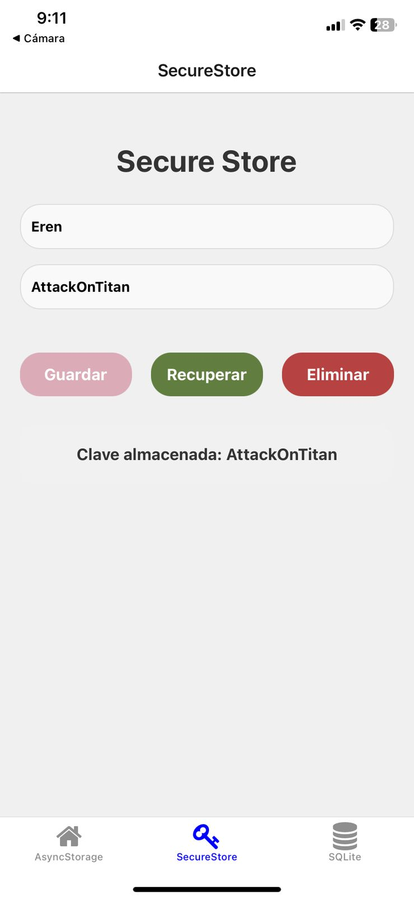
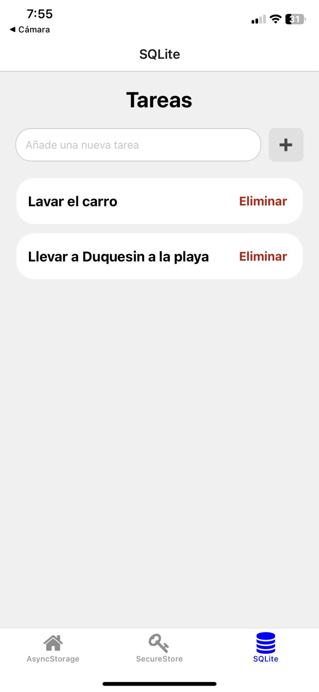

# Manejo de datos con SecureStore y SQLite

Aplicación móvil con React Native y Expo, implementando SecureStore para lamacenar información y SQLite como base de datos.

###### **Funcionalidades con SecureStore:**

* Ingresar información.
* Recuperar información con base a la primera clave ingresada.
* Eliminar la información ingresada.

###### Funcionalidades con SQLite (Gestor de tareas):

* Agregar tarea.
* Consultar tareas almacenadas.
* Eliminar tareas.

---

#### Visualización de las pantallas

###### SecureStore

###### SQLite

